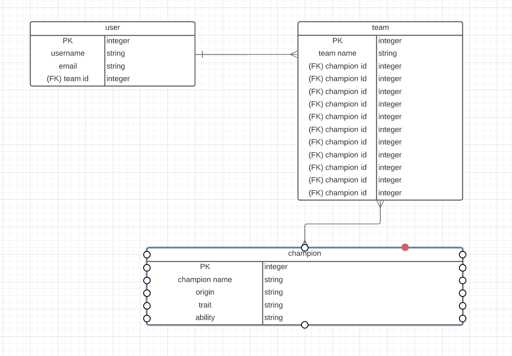
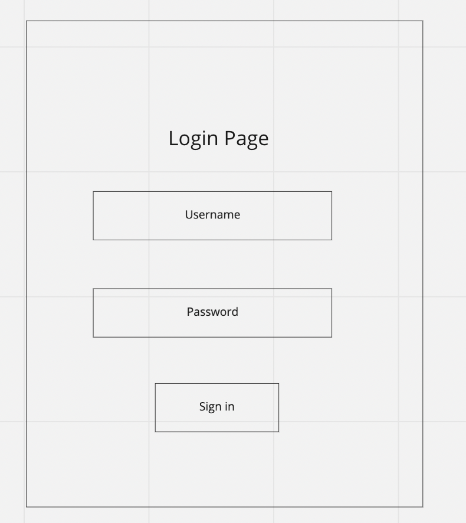
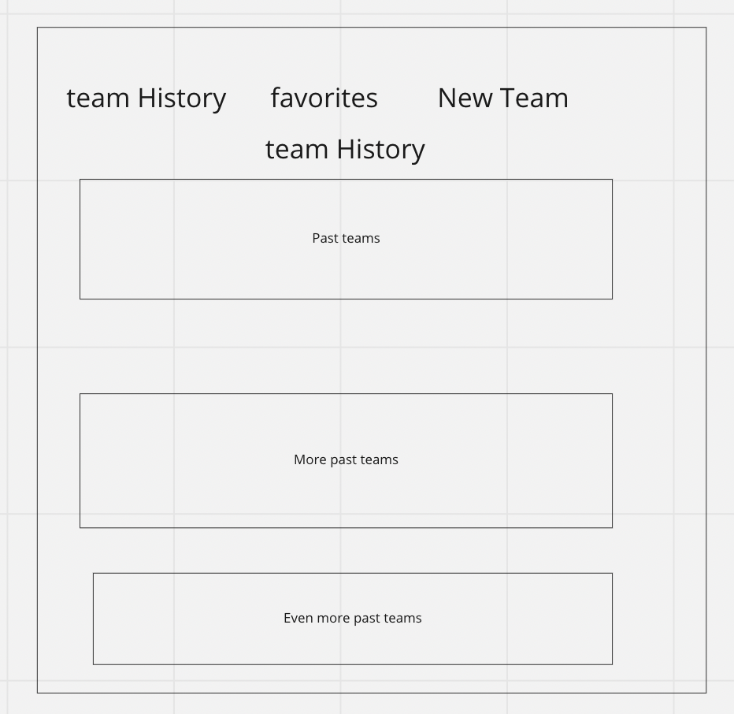
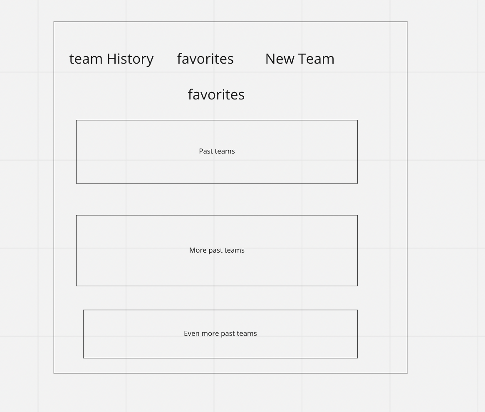
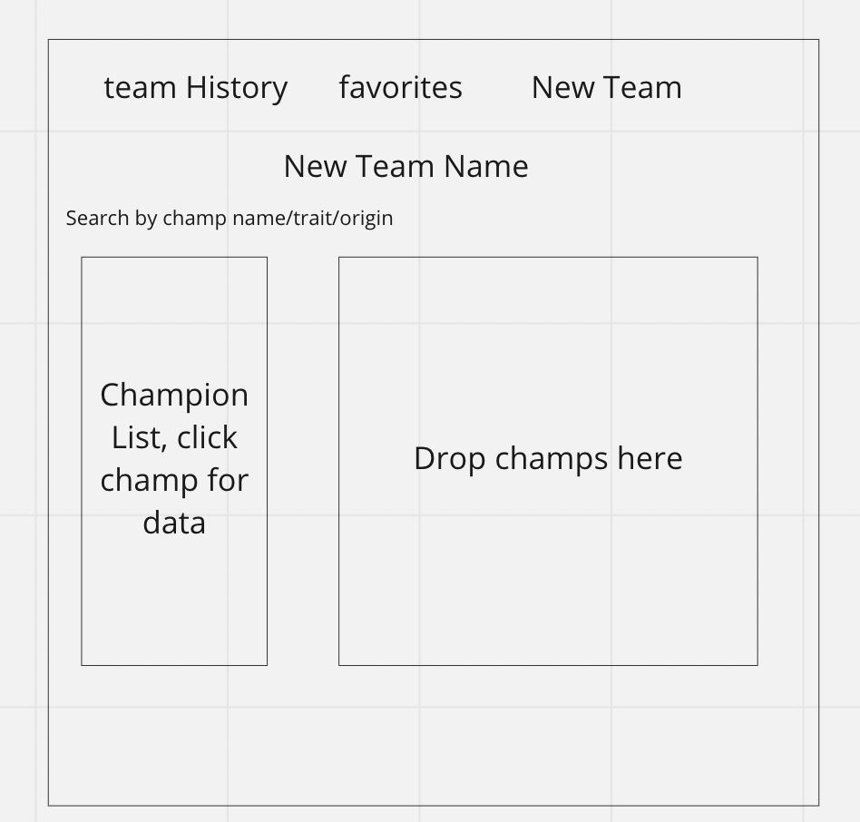
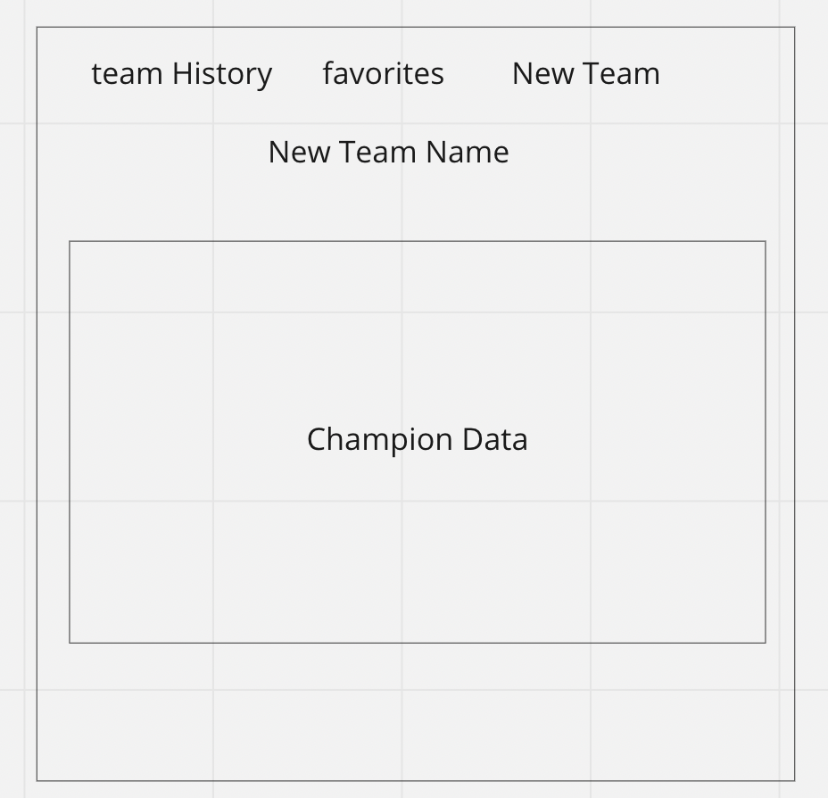

# TFT Team Builder

---
## Project 2 Goals
Teamfight Tactics is a game designed by Riot Games in the format of autochess. My app TFT Team Builder will be using the Riot Games TFT JSON data package in order to use that data to theory-craft and build your own TFT teams. This project will be using Javascript, express, node.js, and postgres. I will be have three models for the user, champion, and team data.

## ERD

## WIREFRAMES

## MVP GOALS
- Have a login page as the home page
- Have a team history page 
- Have a page to view all teams built with delete buttons
- Have buttons to add champs to team

## STRETCH GOALS
- Implement items to add on to champions
- Add a match history to save teams from actual games
- Implement synergies functionality
- Add in Hextech Augments
- Have a team building page with drag and drop

## POTENTIAL ROADBLOCKS
- Need to learn how to seed data and mass import into database
- Figuring out how to implement drag and drop

